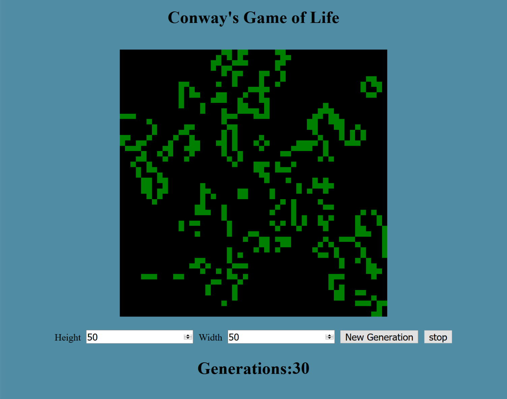

# Conways-Game-Of-Life
Conway is a mathematician who created the Game Of Life. The game of life follows simple rules where a cell either is born, stays alive, or dies after a generation based on how many surrounding cells there are.
If there are too few neighbors it dies from isolation, too many it dies from overcrowding, and if there is enough then a cell is born or stays alive. Created a function which takes a generation and outputs the new generation. Uses react and Css Grid to render
the cell components.

try it on [Codepen](https://codepen.io/Cyberputty/full/XEjQqW/)!
